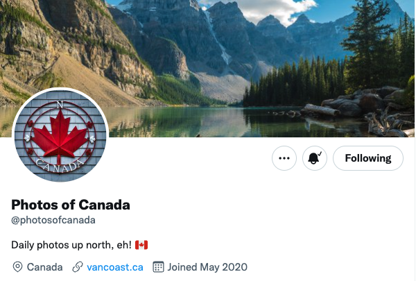

# Canada Photos 

Tweets random photos of Canada from unsplash every few hours.

## Screenshots



## Features

- Automatic hashtags
- Add description from Unsplash
- Set time to tweet
- HQ Images

## Demo

http://twitter.com/photosofcanada

## Environment Variables

To run this project, you will need a twitter and unsplash dev account and add the following environment variables to your .env file

`APP_KEY`
`APP_SECRET`
`ACCESS_TOKEN`
`ACCESS_SECRET`
`UNSPLASH_KEY`

## Deployment

To deploy this project run

```bash
  npm run start
```

## Authors

- [@nicholasherious](https://github.com/nicholasherious)

## Badges
[](https://github.com/nicholasherious/Canada-Photos/actions/workflows/node.js.yml)
[](https://choosealicense.com/licenses/mit/)
[](https://opensource.org/licenses/)
[](http://www.gnu.org/licenses/agpl-3.0)

## Contributing

Contributions are always welcome!
